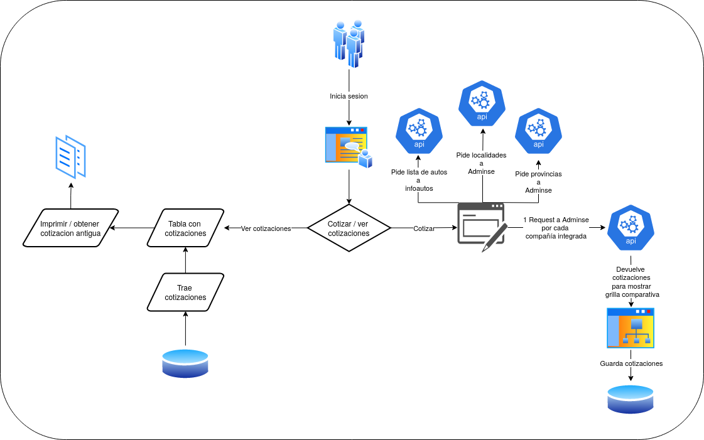

# Cotizador de autos

## Indice
- [Descripción del proyecto](#descripción-del-proyecto)
- [UX/UI](#uxui-)
- [Diagrama de flujo](#diagrama-de-flujo)
- [Integraciones](#integraciones)
  - [Adminse](#adminse)
  - [Infoauto](#infoauto)
- [Persistencia de datos](#persistencia-de-datos)

## Descripción del proyecto
La idea de este proyecto es generar un cotizador de seguros de autos que se pueda brindar a los clientes por medio de un usuario.  
Los clientes cotizarán el auto con distintas compañías y una vez elegida la cotización nos brindarán el número de cotización para poder emitir la misma.  
  
Este proyecto constará de dos integraciones, la primera con Adminse y la segunda con Infoauto.  
Adminse: es la empresa que va a proveer la integración con cada una de las compañías de seguros, para cada compañía que queramos utilizar vamos a tener un payload distinto.
Infoauto: es la empresa que nos va a proveer la lista de autos y sus códigos, los cuales luego debémos pasar a Adminse.

Las integraciones se verán en profundidad en la sección de [integraciones](#TODO: poner link correcto).

## UX/UI 
La UX/UI y el flujo en general debe ser muy similar a lo que veremos en este [video](https://www.youtube.com/watch?v=G5B2-SuU9D0), pero con una vision más modera.  
La idea es que luego de iniciarse sesión el cliente pueda entrar y realizar una nueva cotización o ver las anteriores.  
En la vista de cotizaciones necesitará llenar unos datos, los cuales deberán contemplar los datos que todas las compañías necesitan, para luego poder ver un comparativo del precio de las mismas.

## Diagrama de flujo

## Integraciones
### Adminse
[Página web](https://www.adminse.com.ar/)
Contamos con una colección de postman que indica como utilizar los siguientes endpoints:
- Login POST https://{{coti-host}}/api/auth/login
- Provincias GET https://adminse.com.ar/api/provinces
- Localidades GET https://adminse.com.ar/api/provinces/2/locations
- Allianz GET https://{{coti-host}}/api/cotizador?
- Integrity GET https://{{coti-host}}/api/cotizador?cia=integrity

Estos últimos dos contienen todos los datos necesarios para cotizar en dichas compañías y, en caso de querer integrar más compañías habría que solicitar la colección de postman con todos los datos.

### Infoauto
[Página web](https://www.infoauto.com.ar/)
En este caso no contamos con una colección de postman, habría que hacer el trabajo de discovery, no es mucho más que un loging y GET para traer los autos.
La única particularidad de esta integración es que no se puede cashear la base de autos, ni nada por el estilo, hay que consumirla directamente en cada cotización.

## Persistencia de datos
En una primera instancia lo que se necesita es una manera de brindar acceso por medio de login a distintos clientes y poder guardar el número de cotización que devuelve Adminse para luego poder emitir la póliza con dicha cotización. 
